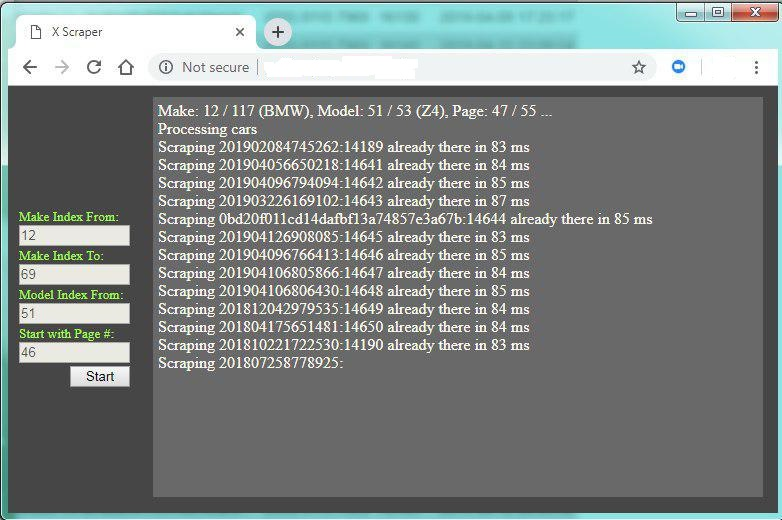

# XScraper

A lightweight **PHP + JavaScript** web app for scraping listings from a European car marketplace (autotrader\[.]co\[.]uk). The codebase was originally built as a demo/portfolio project and is not intended for production use without additional hardening.

> **Heads‑up:** The repository contains working examples that demonstrate scraping tactics (resilience, proxy support, concurrent runs). Treat this as a learning project or a foundation you can extend.

---

## ✨ Key Features

* **Targeted search**: Scrapes car listings using configurable search parameters (location, make/model, etc.).
* **Multi‑instance control**: UI controls let you start/stop scraping for **multiple locations** in parallel.
* **Resilience built‑in**: Defensive techniques detect transient failures (timeouts, empty payloads, unexpected HTML) and automatically retry/continue.
* **Proxy support**: Requests can be routed through proxy servers to reduce throttling and improve reliability.
* **MySQL persistence**: Results are stored in a relational DB via a simple `mysqli` helper.
* **Minimal front‑end**: A small JS app (`app.js`) orchestrates the UI and sends requests to PHP endpoints.



---

## 📦 Repository Structure

```
xscraper/
├─ app.js           # Front‑end logic (UI actions, AJAX calls, progress updates)
├─ sc.html          # Minimal UI to configure/search and control instances
├─ query.php        # Scraping endpoint / controller (builds queries, parses HTML)
├─ mysqlidb.php     # Tiny DB helper around mysqli for reads/writes
├─ Screens/         # Screenshots of the UI in action
├─ README.md        # (You are here)
└─ LICENSE.txt      # GPL‑3.0
```

---

## 🛠 How It Works (high level)

1. **Configure & start** in the UI (`sc.html`): choose location(s) and search parameters; start one or more scraping runs.
2. **Front‑end orchestrates** (`app.js`): sends AJAX requests to `query.php`, tracks progress, and updates the UI.
3. **Server does the work** (`query.php`):

   * Builds the target URL(s) for the marketplace search.
   * Fetches pages (optionally via a proxy).
   * Handles pagination and resilience (retry on empty/invalid responses).
   * Parses listing fields and normalizes data.
   * Calls `mysqlidb.php` to **upsert** results into MySQL.

> The code is optimized for clarity over abstraction: everything you need to follow the flow is in a handful of files.

---

## 📊 Data Collected (typical fields)

The scraper extracts common listing attributes, for example:

* Title / trim
* Price & currency
* Mileage
* Location / distance
* Year / registration
* Engine / transmission / fuel
* Listing URL and image URL(s)

*(Exact fields depend on the target HTML; adjust selectors as the site evolves.)*

---

## ⚙️ Running Locally (dev setup)

> This project is intentionally simple—no frameworks required.

1. **Requirements**

   * PHP 7.4+ with `curl` and `mysqli` extensions
   * MySQL (or MariaDB)
   * A web server (Apache or Nginx) configured for PHP

2. **Database**

   * Create a database and a table for listings (example schema):

     ```sql
     CREATE TABLE listings (
       id INT AUTO_INCREMENT PRIMARY KEY,
       source_id VARCHAR(128) UNIQUE,   -- stable ID from listing URL or composed key
       title VARCHAR(255),
       price INT,
       mileage INT,
       location VARCHAR(255),
       year INT,
       fuel VARCHAR(64),
       transmission VARCHAR(64),
       url TEXT,
       image_url TEXT,
       created_at TIMESTAMP DEFAULT CURRENT_TIMESTAMP,
       updated_at TIMESTAMP DEFAULT CURRENT_TIMESTAMP ON UPDATE CURRENT_TIMESTAMP
     );
     ```
   * Update DB credentials in `mysqlidb.php`.

3. **Web server**

   * Serve the repo as a PHP site.
   * Open `sc.html` in the browser.

4. **Proxies (optional)**

   * Add your proxy configuration where HTTP requests are made in `query.php` (e.g., `CURLOPT_PROXY`).

---

## 🧩 Customization Guide

* **Selectors**: If the marketplace changes its DOM, update the parsing logic in `query.php`.
* **Rate limits**: Introduce random delays / backoff between requests to reduce blocking.
* **Deduplication**: Base `source_id` on a stable part of the listing (e.g., listing ID from URL) and enforce a DB `UNIQUE` index.
* **Observability**: Add basic logging (e.g., write to a file or DB table) with timestamps, page URLs, and error types.
* **Headless fallback**: If HTML gets heavily scripted, swap to a headless browser (e.g., Puppeteer via a sidecar) or use prerendered HTML.

---

## 🔒 Legal & Ethical Use

Scraping may be restricted by a website’s **Terms of Service** and by local law. Use responsibly:

* Check and respect `robots.txt` and ToS.
* Avoid heavy loads; throttle requests.
* Only collect data you’re permitted to use; store it securely.
* This code is provided **as is** for educational purposes.

---

## 🚧 Limitations & Next Steps

* Purpose‑built for one marketplace; **selectors may need updates**.
* No queueing or distributed execution (kept intentionally simple).
* Minimal error reporting.

## 🧾 License

This project is released under the **GPL‑3.0** License. See `LICENSE.txt` for details.

---

## 👤 Author

**Movsar Bekaev**
Email: [movsar.dev@gmail.com](mailto:movsar.dev@gmail.com)
